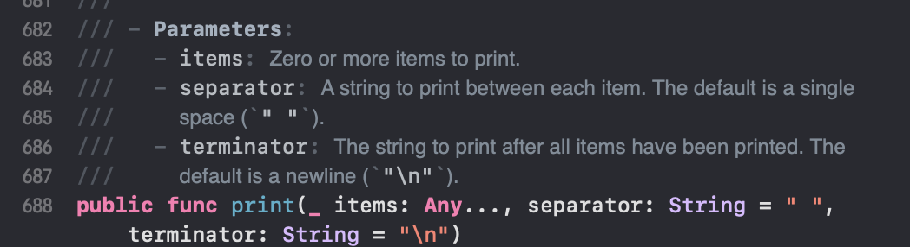
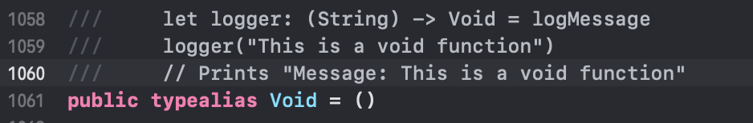

# Functions
### 함수의 정의와 호출
* 함수란 ? 특정 작업을 수행하는 코드 모음
* 함수를  사용하려면 함수의 이름을 호출하고 파라미터를 전달해야한다
```
func 함수이름 (매개변수...) -> 반환타입 {
	실행구문
	return 반환값
}
```

* `func` 라는 키워드를 앞에붙여 함수를 정의한다
* `->` 반환 화살표 뒤에 타입의 이름을 붙여 함수의 반환 타입을 나타  낸다
* **오버라이드**(재정의)와 **오버로드**(중복 정의)를 모두 지원


### Parameters
* 함수는 파라미터가 없을 수도 있고 여러개 일수도 있다
```
func sayHelloWrold() -> String(){
	return "hello, world"
}

func greet(person: String) -> String{
	let greeting = "Hello, "+ person + "!"
	return greeting
}

func greet(pserson: String, alreadyGreeted:Bool) -> String(){
	if alreadyGreeted{
		return greetAgain(person: person)
	} else {
		return greetn(person: person)
	}
}

func hello(name: String) -> String {
	return "hello \(name)!"
}
```
* 첫번째 greet 함수와 두번째 greet함수는 다른 함수다
	* 함수 이름은 같아도 매개변수가 다르면 같은 함수라고 할 수 없다. (오버로드) 
* 전달인자 레이블(Argument Lable) : 함수외부에서 좀 더 명확하게 매개변수의 역할을 알 수 있다
```
func 함수이름( [전달인자 레이블] 매개변수이름 : 매개변수타입) -> 반환타입 {
}

func sayHello(from myName:String, to name:Sting) -> String {
	return "Hello \(name)! I'm \(myName)"
}

func sayHello(_ myName:String, _ name:Sting) -> String {
	return "Hello \(name)! I'm \(myName)"
} // 와일드카일드(_) 식별자를 사용하여 레이블을 사용하지 않을 수도 있다
```
* 레이블만 다르더라도 `오버로드`가 된다

* print 같은경우는 와일드 카드덕분에 전달인자레이블을 사용하지 않아도 되고, separator와 terminator는 지정해주지 않아도 디폴트가 설정되어있다

### inout 매개변수
* 함수내에서 매개변수 값이 바뀔때를의미
* 과정
	1. 함수를 호출할 때, 전달인자의 값을 복사한다
	2. 해당 전달인자의 값을 변경하여 1에서 복사한 것을 함수 내부에서 변경한다
	3. 함수를 반환하는 시점에 2에서 변경된 값을 원래의 매개변수에 할당한다
*  함수 반환 시점에 ㅍ로퍼티 설정자가 호출된다 -> 프로퍼티 감시자는 추후에 공부하자….!
* inout매개변수는 변수 또는 상수 앞에 &를 붙여 표현한다
```
func referenceParameter(_ arr: inout [Int]){
    arr[1] = 1
}

referenceParameter(&numbers)
```

### Return Value
* 리턴 타입을 지정해주지 않을경우 ( -> 가 없을때 ) Void 타입의 특수 갑슬 리턴한다
* Void : 빈튜플 ()

* 반환값을 튜플로 만들어 반환할 수 있다
```
func minMax(array: [Int]) -> (min: Int, max:Int) {
    var currentMin = array[0]
    var currentMax = array[0]
    for value in array[1..<array.count] {
        if value < currentMin {
            currentMin = value
        }else if value > currentMax {
            currentMax = value
        }
    }
    return (currentMin, currentMax)
}

func greeting(for person: String) -> String{
	"Hello, " + person + "!"
} // 함수 내용이 한줄이면 return 값이 됨
```
* **리턴 타입으로 함수**를 사용할수 있다
	* 스위프트의 함수가 `일급 객체`이기 때문
	* 일급 객체 관련 참고 : [Swift Swift 일급 객체 개념 및 사용법](https://any-ting.tistory.com/82)
	
### Nested functions
* 스위프트는 데이터 타입의 중첩이 자유롭다
* Ex) 클래스 안의 클래스 안의 클래스,,,,
```
func chooseStepFunction(backward: Bool) -> (Int) -> Int { 
	func stepForward(input: Int) -> Int { return input + 1 } 		func stepBackward(input: Int) -> Int { return input - 1 } 		return backward ? stepBackward : stepForward }

var currentValue = -4
let moveNearerToZero = chooseStepFunction(backward: currentValue > 0)

while currentValue != 0 {
	print("\(currentValue)... ")
	currentValue = moveNearerToZero(currentValue) } print("zero!")
// -4...  -3...  -2...  -1...  zero!
``` 